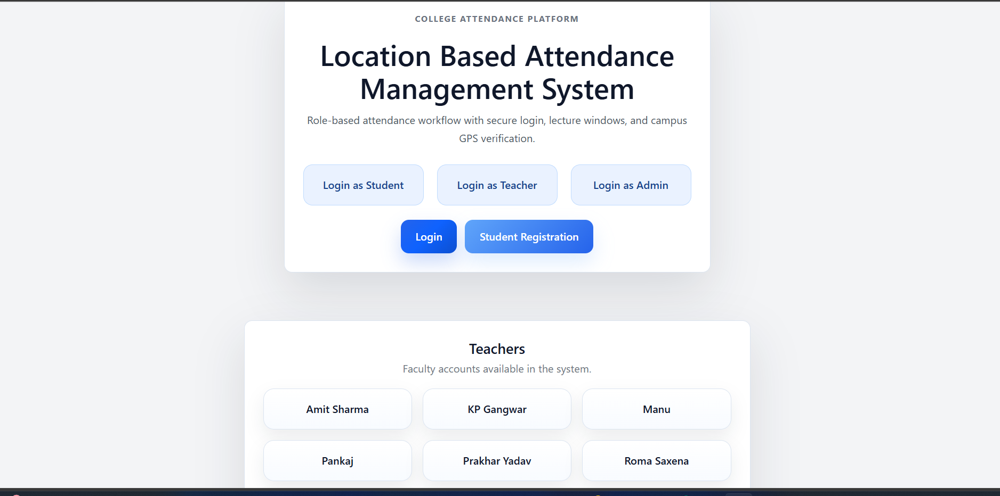
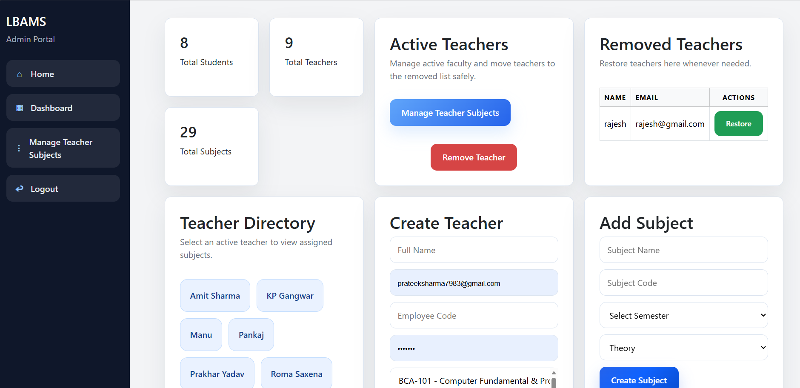
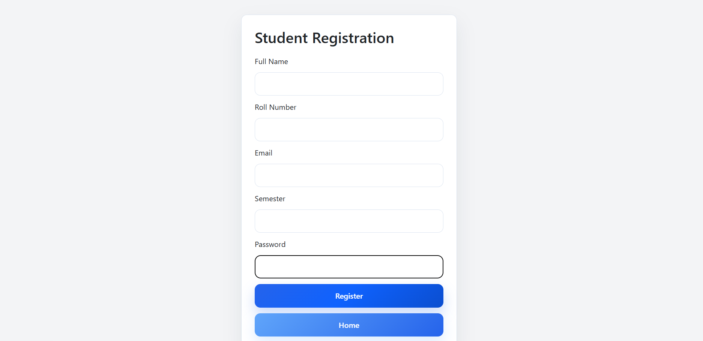

# 📍 Location Based Attendance System (LBAMS)

A Flask-based web application that enables institutions to manage student attendance using location verification, admin approval, and roll number tracking.

---

## 🚀 Features

* 🔐 Student, Teacher & Admin Login System
* 📍 Location-Based Attendance Marking
* ✅ Admin Approval for Student Registration
* ❌ Reject / Approve System with Safety Checks
* 👨‍🏫 Teacher Management (Add / Remove / Restore)
* 🆔 Roll Number System for Students
* 📊 Attendance Tracking (Subject-wise + History)
* 🔎 Admin Search by Roll Number
* 🔒 Secure Actions (Admin Password Confirmation)

---

## 🛠️ Tech Stack

* **Backend:** Flask (Python)
* **Database:** SQLite (SQLAlchemy ORM)
* **Frontend:** HTML, CSS, Bootstrap
* **Authentication:** Flask-Login

---

## 📸 Screenshots

### 🏠 Home Page


### 🛠 Admin Dashboard


### 📝 Student Registration


## ⚙️ Installation & Setup

1. Clone the repository

```bash
git clone https://github.com/prateek-sharma7983/LBAMS.git
```

2. Navigate to project folder

```bash
cd LBAMS
```

3. Install dependencies

```bash
pip install -r requirements.txt
```

4. Run the application

```bash
python app.py
```

5. Open in browser

```bash
http://127.0.0.1:5000
```

---

## 📌 Usage

* Students register and wait for admin approval
* Admin approves or rejects requests
* Students mark attendance based on location
* Admin can search attendance using roll number
* Teachers can be managed by admin panel

---

## 👨‍💻 Author

**Prateek Sharma**

---

## ⭐ Support

If you like this project, please ⭐ star the repository!
